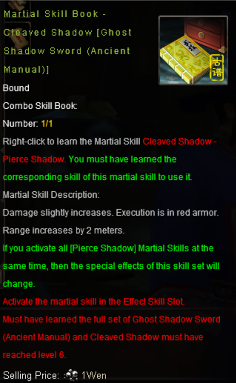
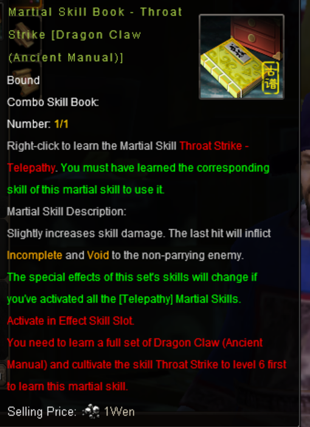
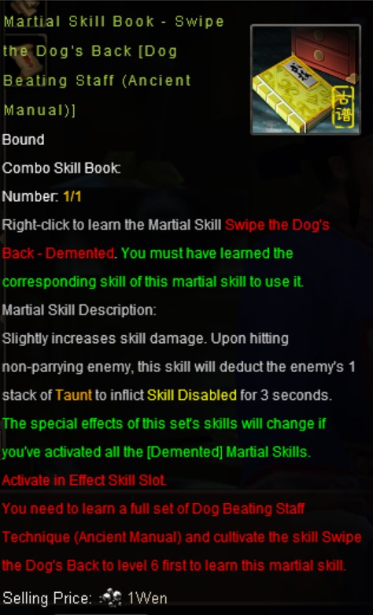
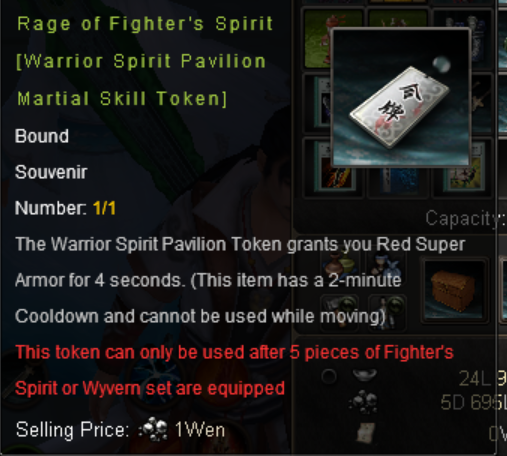
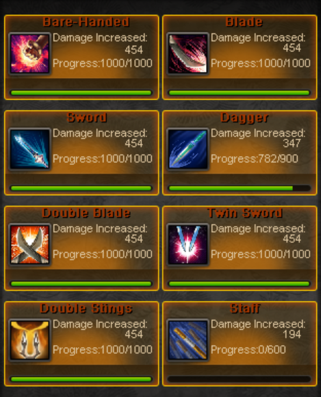
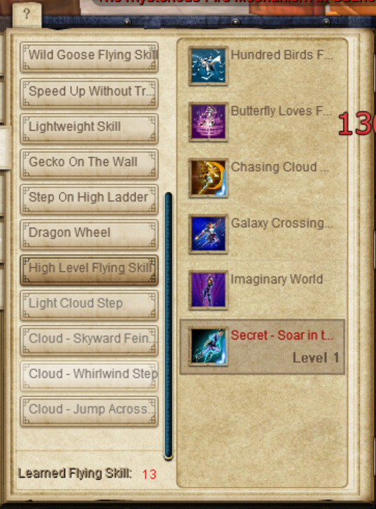
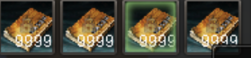
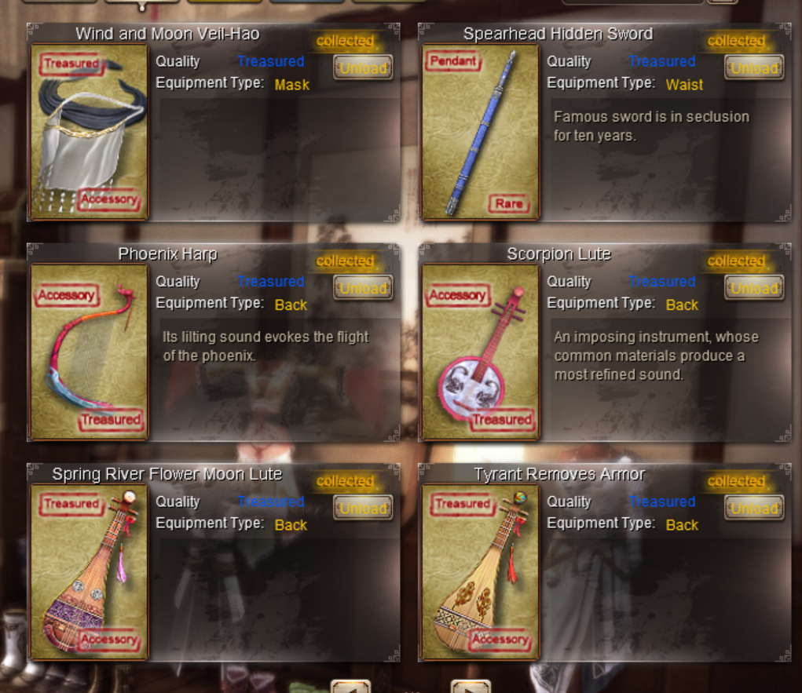
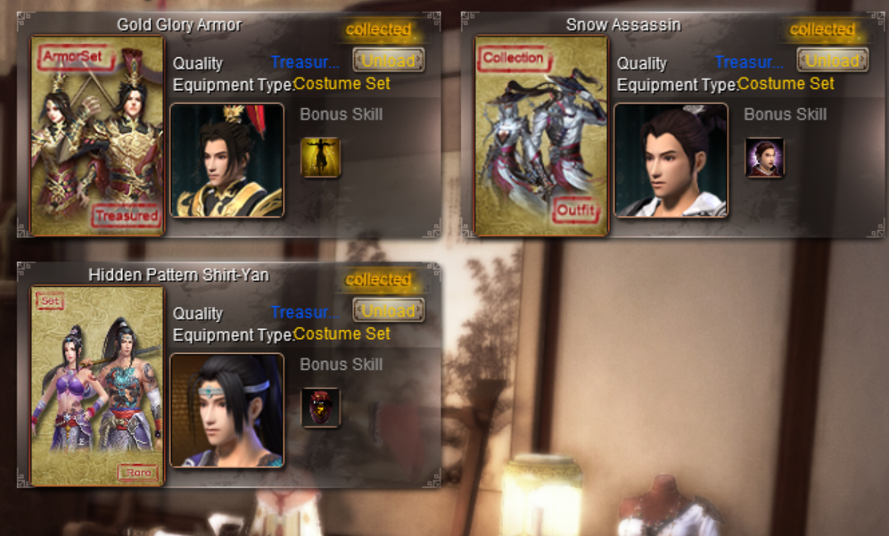

# Silex - Scholars in Disguise (Needle Shen Family)

## Account Overview

**Important:** Every item listed below is bound to the character unless otherwise specified.

### Character Information

- Character Name: **Silex**
- Sect: **Scholars in Disguise**
- Faction: **Needle Shen Family**
- Build: **Heavily Internal-focused**
- Strength: **Keep Your Own Counsel**
- Internal Points: **131**
- Meridian Level: **3980**

### Study Progress

- Internal Skills Study: **1.5B+**
- Martial Arts Study: **135M+**
- Martial Arts Collected: **622 / 700**

### Price: 650$
this price is not final, and its open for negotiations.
#### discord: bye5701

---

# Major Selling Points

- Scholars Inner 1-6 fully unlocked: **36/36, 36/36, 36/36, 49/49, 49/49, 49/49**
- **131 Internal Points**
- **Meridian Level 3980**
- **1.5B+ Internal Study**
- **622 / 700 Martial Arts Collection**
- Multiple rework-available martial arts
- Full C7 Internal gear setup
- Large Battlefield gear collection
- Rare Ancient Manual combo books
- **24 Teals**
- Extensive inner cultivation progress across multiple sects, factions, subsects, and Jianghu inners

---

# Very Valuable / Expensive Items

## Ghost Shadow Sword (Ancient Manual) Rework

### Cleaved Shadow - Pierce Shadow

- Ancient Manual Combo Skill Book
- Rage GSS combo book
- Set is **not currently learned** on the character

## Dragon Claw (Ancient Manual) Rework

### Throat Strike - Telepathy

- Ancient Manual Combo Skill Book
- Corresponds to Dragon Claw Ancient
- Dragon Claw Rage currently **3/3**

## Dog Beating Staff (Ancient Manual) Rework

### Swipe the Dog's Back - Demented

- Ancient Manual Combo Skill Book

## Rage of Fighter's Spirit

**Warrior Spirit Pavilion Martial Skill Token**

- Grants Red Super Armor for 4 seconds
- 2 minute cooldown
- Requires 5 pieces of Fighter's Spirit or Wyvern set

---

# Inner Skill Progression

## Scholars Inners

| Inner | Unlocked |
|---|---|
| Scholars Inner 1 | 36/36 |
| Scholars Inner 2 | 36/36 |
| Scholars Inner 3 | 36/36 |
| Scholars Inner 4 | 49/49 |
| Scholars Inner 5 | 49/49 |
| Scholars Inner 6 | 49/49 |

## Sect Inners

| Sect | Inner 1 | Inner 2 | Inner 3 |
|---|---:|---:|---:|
| Shaolin | 30/30 | 30/30 | 30/30 |
| Wudang | 30/30 | 30/30 | 30/30 |
| Emei | 30/30 | 30/30 | 30/30 |
| Beggars' Sect | 30/30 | 30/30 | 30/30 |
| Tangmen | 30/30 | 30/30 | 30/30 |
| Wanderers Valley | 30/30 | 30/30 | 30/30 |
| Royal Guards | 30/30 | 30/30 | 30/30 |
| Ming | 19/30 | 1/30 | 1/30 |

## Faction Inners

| Faction | Unlocked |
|---|---:|
| Peach Blossom Island | 36/72 |
| Golden Needle Sect / Shen Family | 50/93 |
| Xu Family | 51/51 |
| Beast Villa | 84/84 |

## Subsect Inners

| Subsect | Inner 1 | Inner 2 |
|---|---:|---:|
| Blood Blade Clan | 49/49 | 72/72 |
| Ancient Tomb | 30/30 | 64/64 |
| Chengfang | 26/30 | 15/15 |
| Nianluo Dam | 33/49 | 72/72 |
| Mount Hua | 49/49 | 72/72 |
| Five Immortals | 30/30 | 63/63 |
| Dharma Sect | 27/49 | 72/72 |
| Shenji Camp | 13/49 | 65/72 |

## Jianghu Inners

| Jianghu Inner | Unlocked |
|---|---:|
| Self Reflection | 42/42 |
| True Chi | 30/30 |
| Chaotic Yuan | 75/75 |
| Taoist Divination | 49/49 |
| Sunset | 36/36 |
| Five Elements | 36/36 |
| Purple Rosy | 49/49 |
| Poison Toad | 39/64 |
| Against Worldly Evil | 52/52 |
| Ice Heart Code | 55/64 |
| Drain of Qi (Treasure) | 1/36 |
| Blood Blade | 64/64 |
| Six Realms (Lingxiao) | 75/75 |
| Lucky Inner | 1/1 |

---

# Martial Arts Collection

## Scholars Martial Arts

### Falling Flower Sword (Scholars 1st)

- Important skills: **9/9**
- Rework Available

### Leisure Kick (Scholars 2nd)

- Rage: **13/13**
- Parry Buff: **13/13**

### Boundless Sword (Scholars 3rd)

- Important skills: **7/7**

### Jade Flute Sword (Scholars 4th)

- Multiple advanced skills unlocked
- Rework Available except rage and AoE, iirc

## Ancient / Jianghu Martial Arts

### Dragon Claw (Ancient)

- Rage: **3/3**
- Rework Available

### Dog Beating Staff (Ancient)

- Rage: **1/3**

### Tai Chi Fist (Ancient)

- Full Combo (break + charge): **1/3**
- Bubble: **3/3**
- Rage: **3/3**

### Shallow Kungfu

- Tiger Push: **16/16**

### Snow Sword

- lvl 1, Rework Available

### Heartless Seven

- **1/6**
- Rework Available

### Wind Fury

- Quick Shadow: **13/13**
- Wind Travel: **11/11**

### Guxi Dagger

- Charges + rage: **12/12**

## Cash Shop Martial Arts

### Buddha Palm

- Break: **12/12**
- Stun: **12/12**
- Remaining skills mostly **10/12**

### Curled Branch

- Mostly **10/10**

### Nine Palaces

- Main AoE: **10/10**
- Small circle AoE: **8/10**

### Phantom Twin

- Multiple skills at level 10

## School Martial Arts

### Perishable Blade

- **5/5**

### Taiji

- Swap: **4/4**
- Mana Regen: **4/4**

---

# Weapon Manuals

| Weapon | Progress |
|---|---:|
| Bare-Handed | 1000/1000 |
| Blade | 1000/1000 |
| Sword | 1000/1000 |
| Double Blade | 1000/1000 |
| Twin Sword | 1000/1000 |
| Double Stings | 1000/1000 |
| Hidden Weapon | 1000/1000 |
| Qimen | 1000/1000 |
| Dagger | 782/900 |
| Staff | 0/600 |
| Quarter Staff | 2/600 |

---

# Flying Skills

- Learned Flying Skills: **13**
- All Flying Skill Passives: **5/5**
- Secret - Soar in the Cloud: **1/4**

---

# Meridian Progression

## Sect / Subsect Meridians

| Meridian | Sect | Subsect | Treasure
|---|---:|---:|---:|
| Greater Yin Lung (Emei)| 216 | 180 | 560/1200 Energy| 
| Lesser Yang Sanjiao (Wanderer's Valley)| 216 | 216 | 140/180 Spirit|
| Greater Yang (Beggar)| 216 | 216 | 156/180 Stamina|
| Lesser Yin (Wudang)| 216 | 216 | 360/1200 Energy|
| Reverting Yin (Scholars)| 216 | 216 | 132/180 Breath|
| Greater Yin Spleen (Tangmen)| 216 | 216 | 52/180 Dexterity|
| Lesser Yang Gallbladder (Royal Guard)| 144 | 0 | |
| Yang Brightness (Shaolin)| 216 | 216 | |

## Special Meridians

- Qi Gathering in Dantian: **72/72**
- Yin Qiao: **145** + 211 power
- Yang Qiao: **90** + 82 power
- Yin Linking Meridian: **45**
- Girdling Meridian: **90**
- Hidden Yin: **180** + 281 power
- Hidden Yang: **180** + 248 power

---

# Gear

## Gear Overview

- Very well-geared internal character
- Full C7 internal-focused main setup
- Internal treasure configured for Buddha Palm damage increase
- External treasure available for Perishable Blade / Wanderer's Villa PvE setup
- Jade Dolls mostly rolled with jade/gold stats

## Main Internal Gear

### Normal Armor - C7

- Head
- Earrings
- Rings
- Necklace
- Top
- Boots
- 2x Bracers
- 2x Leggings

### Important Gear Bonuses

- **+30% Nihility**
  - Used for Buddha Palm stun / yellow effect
- **+20% Green Shadows of a Maiden**
  - Scholar 2nd set kick rage bonus

### Buff Setups

- 6-piece Protective Treasure Robe buff
- 2x Rings + Spikes on Resurgence buff

## Main Weapons

- C7 Twin Daggers / Spikes
- C6 Sword

## Old World Items

- C7 Old World Boots
- C6 Old World Normal Leggings

## Treasures

### Internal Treasure

- Configured for Buddha Palm damage increase

### External Treasure

- Perishable Blade setup
- Wanderer's Valley PvE setup

## Jade Dolls

Mostly jade/gold rolls:

- External Defense
- Ignore Yin
- Ignore Yang
- Ignore Hardness
- Yin/Yang Damage

Additional external-focused dolls included.

## Battlefield Gear

### C7 Battlefield Gear

- Boots
- Pants
- Head
- Hidden Weapon / Claw
- Twin Swords
  - +20% 2N4 Shoulder AoE (9 Palace cash shop set AoE)

### C6 Battlefield Gear

- Sword
- Spikes
- 2x Sabres
- Short Staff

---

# Resources

## Battlefield Currency

- 670 Sky Ladder Honor
- 13 Battle Master Tokens (C7 exchange item)

## Materials

- 1900 Demon Gate Tokens
- 760 Desolate Beast Stones
- 2100 Pure Yang Sword Materials

## Aggregates

- 45,236 Five Aggregates

## Teals

- Very rare **24 Teals**

---

# Mounts, Pets & Cosmetics

## Mounts

- Double Saddle
- White Camel

## Pets

- Panda
- Bird
- Mengmeng
- Howling Kirin
- Various Minks (not Jade)

## Treasured Accessories

- Wind and Moon Veil - Hao
- Spearhead Hidden Sword
- Phoenix Harp
- Scorpion Lute
- Spring River Flower Moon Lute
- Tyrant Removes Armor

## Costume Sets

- Gold Glory Armor
- Snow Assassin
- Hidden Pattern Shirt - Yan

